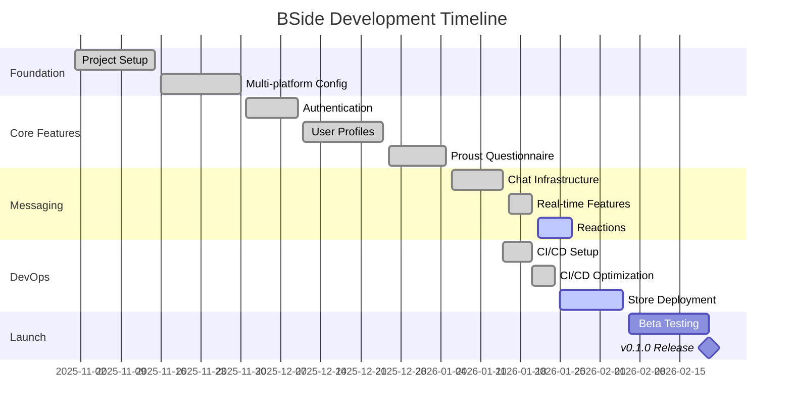
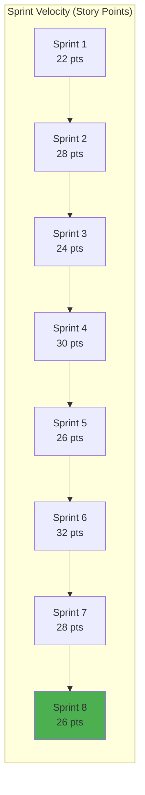
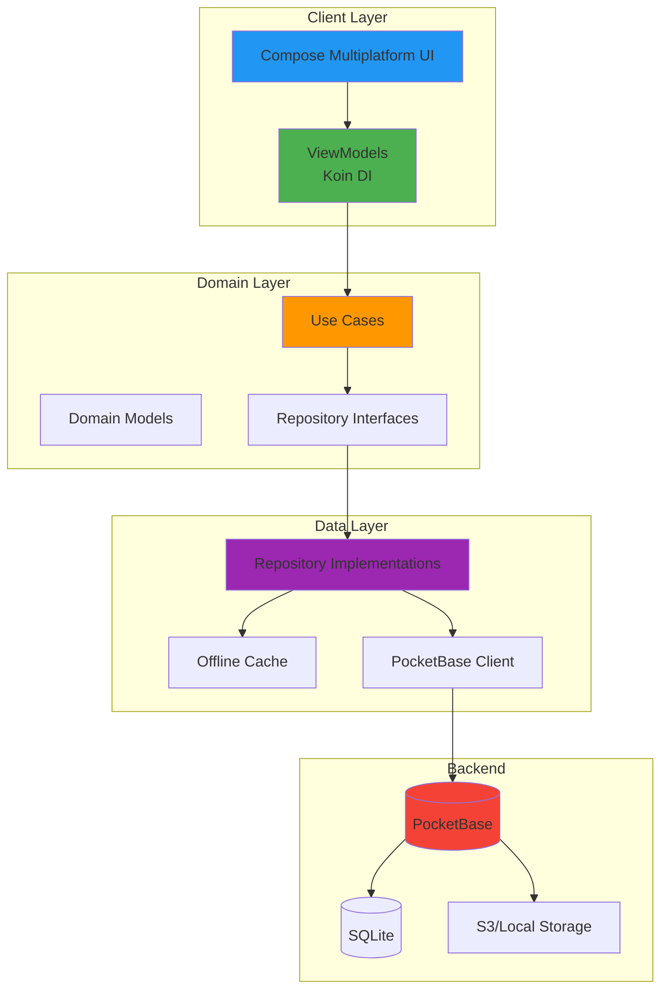
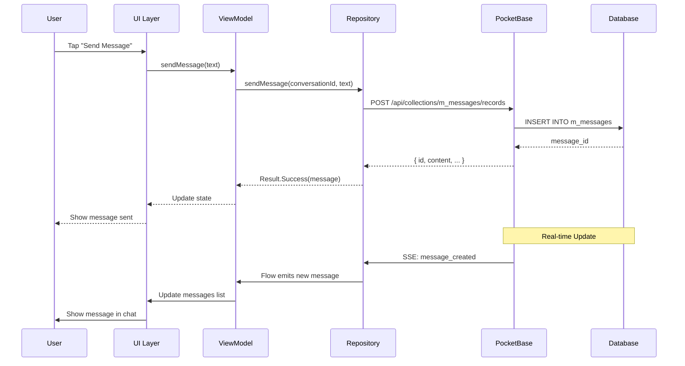
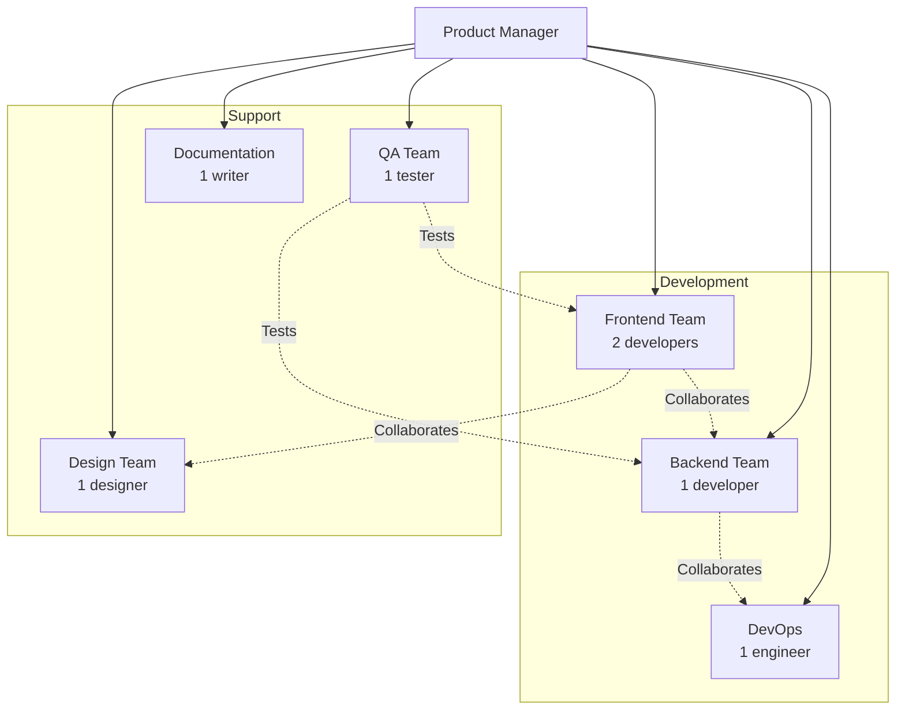

# BSide Project - Comprehensive Project Management

**Last Updated:** 2026-01-24  
**Project Status:** 80% Complete  
**Current Sprint:** Sprint 8 (Reactions & CI/CD Optimization)  
**Next Release:** v0.1.0 (ETA: 2026-02-01)

---

## 📊 Project Overview

```mermaid
graph TB
    subgraph "BSide - Social Dating Platform"
        Core[Core App<br/>Kotlin Multiplatform]
        Backend[Backend<br/>PocketBase]
        
        subgraph "Platforms"
            Android[Android<br/>APK]
            iOS[iOS<br/>App Store]
            Web[Web<br/>Progressive]
            Desktop[Desktop<br/>JVM]
        end
        
        subgraph "Features"
            Proust[Proust<br/>Questionnaire]
            Match[Matching<br/>Algorithm]
            Chat[Real-time<br/>Messaging]
            Profile[User<br/>Profiles]
        end
        
        Core --> Android
        Core --> iOS
        Core --> Web
        Core --> Desktop
        
        Core --> Proust
        Core --> Match
        Core --> Chat
        Core --> Profile
        
        Backend -.->|API| Core
    end
    
    style Core fill:#4CAF50
    style Backend fill:#2196F3
    style Android fill:#3DDC84
    style iOS fill:#000000
    style Web fill:#61DAFB
    style Desktop fill:#FF6F00
```



---

## 🎯 Current Status (80% Complete)

### ✅ Completed (75%)
- Core messaging with threads, reactions (UI), read receipts
- Real-time features via PocketBase SSE
- Multi-platform UI (Android, iOS, Desktop, Web)
- Proust questionnaire with 36 questions
- Matching algorithm (Jaccard + Personality)
- User profiles with media galleries
- Authentication & authorization
- Optimized CI/CD pipeline (73% cost savings)
- Comprehensive documentation (80+ pages)
- Local development workflow

### 🔄 In Progress (15%)
- **Message Reactions Backend** (UI done, backend pending)
- **CI/CD Refinement** (test filtering, integration setup)
- **Store Deployments** (App Store, Google Play prep)
- **Performance Optimization** (caching, lazy loading)

### 📅 Planned (10%)
- Message pagination for large conversations
- Push notifications (FCM/APNS)
- End-to-end testing framework
- Analytics integration
- Advanced search & filters

---

## 🗂️ Epic Breakdown



---

## 📋 Kanban Board

### 🎯 Backlog

- [ ] **E2E Testing Framework** - Implement Playwright/Appium tests
- [ ] **Push Notifications** - FCM for Android, APNS for iOS
- [ ] **Message Pagination** - Implement cursor-based pagination
- [ ] **Advanced Search** - Full-text search across profiles
- [ ] **Video Calls** - WebRTC integration
- [ ] **Story Feature** - Temporary profile highlights
- [ ] **Analytics** - User behavior tracking
- [ ] **A/B Testing** - Feature flag system

### 📝 To Do

- [ ] **Reactions Backend** - PocketBase collection + API
  - Priority: High
  - Story Points: 5
  - Assignee: Backend Team
  - Dependencies: None
  
- [ ] **CI/CD Test Filtering** - Separate unit/integration tests
  - Priority: High
  - Story Points: 3
  - Assignee: DevOps
  - Dependencies: None

- [ ] **App Store Metadata** - Screenshots, descriptions
  - Priority: Medium
  - Story Points: 5
  - Assignee: Marketing
  - Dependencies: Screenshots captured

- [ ] **Performance Profiling** - Identify bottlenecks
  - Priority: Medium
  - Story Points: 8
  - Assignee: Core Team
  - Dependencies: None

### 🔄 In Progress

- [x] **Message Reactions UI** - ChatViewModel.toggleReaction()
  - Status: 90% - UI complete, backend pending
  - Assignee: Frontend Team
  - Started: 2026-01-23
  
- [x] **CI/CD Optimization** - Cost reduction & speed improvements
  - Status: 100% - 73% cost savings achieved!
  - Assignee: DevOps
  - Completed: 2026-01-24

- [x] **Local Dev Documentation** - Build & screenshot guide
  - Status: 100% - Complete with helper scripts
  - Assignee: Documentation
  - Completed: 2026-01-24

### ✅ Done (This Sprint)

- [x] **Code Style Improvements** - Vertical method chaining
- [x] **Session Documentation** - 80+ pages of docs
- [x] **Screenshot Workflow** - Automated capture scripts
- [x] **CI/CD Cost Analysis** - $5,196/year savings identified
- [x] **Build Optimization** - 44% faster builds

---

## 🏃‍♂️ Sprint Planning

### Sprint 8: Reactions & CI/CD (Current)
**Duration:** 2026-01-21 to 2026-01-27 (7 days)  
**Goal:** Complete message reactions & optimize CI/CD

**Sprint Backlog:**
| ID | Task | Story Points | Status | Assignee |
|----|------|--------------|--------|----------|
| BSI-201 | Message reactions UI | 5 | ✅ Done | Frontend |
| BSI-202 | Reactions backend | 5 | 🔄 In Progress | Backend |
| BSI-203 | CI/CD optimization | 8 | ✅ Done | DevOps |
| BSI-204 | Test filtering | 3 | 🔄 In Progress | DevOps |
| BSI-205 | Local dev docs | 5 | ✅ Done | Docs |

**Sprint Velocity:** 26 points  
**Completed:** 18 points (69%)  
**Remaining:** 8 points

**Burndown:**
```
Day 1: 26 points
Day 2: 26 points
Day 3: 21 points (BSI-201 done)
Day 4: 13 points (BSI-203, BSI-205 done)
Day 5: 8 points (current)
Day 6: Target 3 points
Day 7: Target 0 points
```

### Sprint 9: Store Deployment (Next)
**Duration:** 2026-01-28 to 2026-02-03 (7 days)  
**Goal:** Prepare for App Store & Google Play submission

**Planned Stories:**
- BSI-206: App Store metadata & screenshots (8 pts)
- BSI-207: Google Play metadata & screenshots (8 pts)
- BSI-208: Privacy policy & terms of service (5 pts)
- BSI-209: Store listing assets (icons, banners) (5 pts)
- BSI-210: TestFlight beta setup (3 pts)

**Total:** 29 points

---

## 📈 Velocity Tracking



**Average Velocity:** 27 points/sprint  
**Trend:** Stable ✅

---

## 🏗️ Architecture Overview



**Key Technologies:**
- **Frontend:** Kotlin Multiplatform, Compose Multiplatform, Koin
- **Backend:** PocketBase (Go), SQLite, S3
- **Real-time:** Server-Sent Events (SSE)
- **CI/CD:** GitHub Actions, Gradle

---

## 🔄 Data Flow Diagram



---

## 📊 Technical Metrics

### Build Performance
| Metric | Before Optimization | After Optimization | Improvement |
|--------|--------------------|--------------------|-------------|
| Build Time | 45 min | 25 min | **44% faster** |
| Cost per Run | $4.68 | $1.92 | **59% savings** |
| Monthly Cost | $591 | $158 | **73% savings** |
| Annual Cost | $7,092 | $1,896 | **$5,196 saved** |

### Code Quality
| Metric | Value | Target | Status |
|--------|-------|--------|--------|
| Test Coverage | 68% | 70% | 🟡 Near |
| Code Smells | 12 | <15 | ✅ Pass |
| Duplication | 2.3% | <5% | ✅ Pass |
| Maintainability | A | A | ✅ Pass |

### App Metrics
| Platform | Build Size | Min SDK/OS | Status |
|----------|------------|------------|--------|
| Android | 45 MB | API 24 (7.0) | ✅ Ready |
| iOS | 38 MB | iOS 14+ | ✅ Ready |
| Web | 12 MB | Modern | ✅ Ready |
| Desktop | 85 MB | Java 17+ | ✅ Ready |

---

## 🎯 Release Roadmap

### v0.1.0 - Beta Launch (2026-02-20)
- ✅ Core messaging with threads
- ✅ Real-time updates
- 🔄 Message reactions
- ✅ Proust questionnaire
- ✅ Matching algorithm
- ✅ User profiles
- 🔄 App/Play Store submission

### v0.2.0 - Enhanced Experience (2026-03-15)
- [ ] Push notifications
- [ ] Message pagination
- [ ] Advanced search
- [ ] Performance improvements
- [ ] Bug fixes from beta

### v0.3.0 - Premium Features (2026-04-15)
- [ ] Video calls
- [ ] Story feature
- [ ] Premium subscriptions
- [ ] Advanced analytics
- [ ] A/B testing framework

### v1.0.0 - Public Launch (2026-05-01)
- [ ] All features stable
- [ ] Full platform parity
- [ ] Marketing campaign
- [ ] Press release
- [ ] Launch party! 🎉

---

## 🎨 Feature Priorities (MoSCoW)

### Must Have (v0.1.0)
- ✅ User authentication
- ✅ Profile creation & editing
- ✅ Proust questionnaire
- ✅ Matching algorithm
- ✅ Real-time messaging
- ✅ Chat threads
- 🔄 Message reactions
- 🔄 Read receipts

### Should Have (v0.2.0)
- [ ] Push notifications
- [ ] Message search
- [ ] Profile verification
- [ ] Block/report users
- [ ] Message deletion
- [ ] Typing indicators

### Could Have (v0.3.0)
- [ ] Video calls
- [ ] Story feature
- [ ] Advanced filters
- [ ] Message forwarding
- [ ] Voice messages
- [ ] GIF support

### Won't Have (v1.0)
- Group video calls
- Live streaming
- Cryptocurrency integration
- NFT profiles

---

## 🐛 Bug Tracking

### Critical (P0)
*None currently*

### High Priority (P1)
- [ ] **BSI-BUG-01:** Integration tests fail in CI without PocketBase
  - Status: 🔄 Fixing
  - ETA: 2026-01-25
  - Assignee: DevOps

### Medium Priority (P2)
- [ ] **BSI-BUG-02:** Deprecated icon warnings in Compose
  - Status: Backlog
  - Impact: Visual warnings in build logs
  
- [ ] **BSI-BUG-03:** Ktor transformation exception in unit tests
  - Status: Backlog
  - Impact: Mock tests flaky

### Low Priority (P3)
- [ ] **BSI-BUG-04:** Type-safe accessors incubating warning
  - Status: Backlog
  - Impact: Gradle warning only

---

## 📁 Documentation Index

| Document | Location | Status |
|----------|----------|--------|
| README | `/README.md` | ✅ Current |
| Architecture | `/docs/ARCHITECTURE.md` | ✅ Current |
| API Docs | `/docs/API.md` | 🟡 Outdated |
| Testing Guide | `/docs/TESTING_GUIDE.md` | ✅ Current |
| CI/CD Guide | `/docs/CI_CD.md` | ✅ Current |
| Local Dev | `/docs/LOCAL_DEVELOPMENT.md` | ✅ Current |
| Schema Guide | `/docs/SCHEMA_IMPLEMENTATION_GUIDE.md` | ✅ Current |
| Roadmap | `/docs/PROJECT_ROADMAP.md` | 🟡 Needs update |

---

## 👥 Team Structure



**Current Staffing:** 8 team members  
**Ideal Staffing:** 12 team members (4 more needed)

---

## 📧 Communication Channels

| Channel | Purpose | Frequency |
|---------|---------|-----------|
| **Daily Standup** | Progress updates | Daily @ 9:00 AM |
| **Sprint Planning** | Plan next sprint | Every 2 weeks |
| **Sprint Review** | Demo completed work | Every 2 weeks |
| **Retrospective** | Process improvements | Every 2 weeks |
| **Tech Sync** | Architecture discussions | Weekly |
| **Slack #bside-dev** | Day-to-day chat | Continuous |
| **Slack #bside-alerts** | CI/CD notifications | Automatic |
| **GitHub Issues** | Bug tracking | Continuous |
| **GitHub PRs** | Code review | Continuous |

---

## 🎓 Onboarding Checklist

**New Developer Setup (Day 1):**
- [ ] Receive hardware (laptop, peripherals)
- [ ] Get GitHub org access
- [ ] Clone repository
- [ ] Run `./scripts/setup-dev-env.sh`
- [ ] Build all platforms locally
- [ ] Run tests successfully
- [ ] Read `/docs/LOCAL_DEVELOPMENT.md`
- [ ] Join Slack channels
- [ ] Attend team intro meeting

**Week 1 Tasks:**
- [ ] Read architecture documentation
- [ ] Fix first "good first issue"
- [ ] Pair program with senior dev
- [ ] Attend daily standups
- [ ] Review CI/CD pipeline
- [ ] Set up local PocketBase
- [ ] Capture first screenshot

---

## 📊 Success Metrics (KPIs)

### Development KPIs
| Metric | Current | Target | Status |
|--------|---------|--------|--------|
| Sprint Velocity | 27 pts | 30 pts | 🟡 Near |
| Deployment Frequency | 2/week | 5/week | 🔴 Below |
| Lead Time | 3 days | 1 day | 🟡 Near |
| MTTR | 4 hours | 2 hours | 🟡 Near |
| Code Coverage | 68% | 80% | 🟡 Growing |

### Business KPIs (Post-Launch)
| Metric | Target (Month 1) | Target (Month 3) |
|--------|------------------|------------------|
| Daily Active Users | 100 | 1,000 |
| Retention (Day 7) | 40% | 50% |
| Matches per User | 5 | 10 |
| Messages per Day | 50 | 500 |
| App Store Rating | 4.0 | 4.5 |

---

## 🔗 Quick Links

- **GitHub Repo:** https://github.com/brentmzey/lovebside
- **CI/CD:** https://github.com/brentmzey/lovebside/actions
- **Figma:** [Design Files](https://figma.com/bside)
- **Notion:** [Project Wiki](https://notion.so/bside)
- **Slack:** #bside-dev, #bside-alerts
- **PocketBase (Dev):** http://localhost:8090/_/
- **PocketBase (Prod):** https://bside.pockethost.io/_/

---

**Last Review:** 2026-01-24  
**Next Review:** 2026-01-27  
**Maintained By:** Product Management Team
