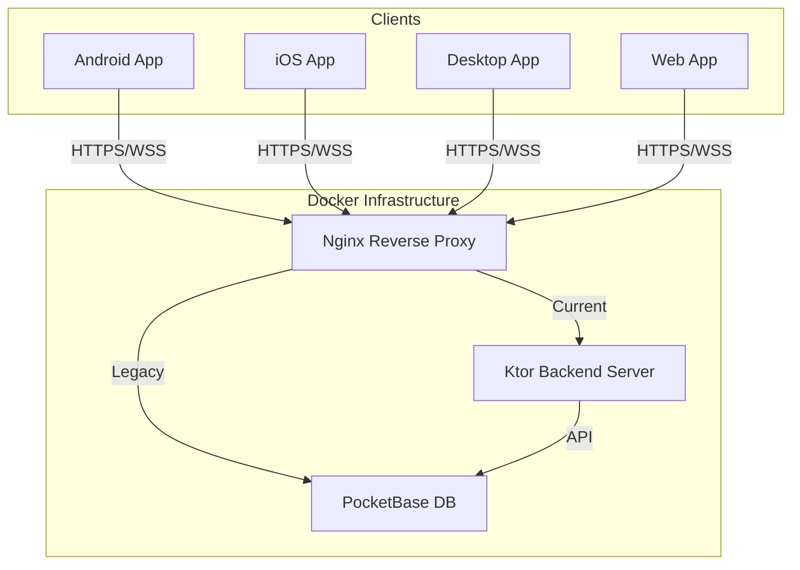

# B-Side: Kotlin Multiplatform Messaging App

**An advanced messaging application built with Kotlin Multiplatform (KMP), Compose Multiplatform, and PocketBase.**

B-Side demonstrates a production-ready KMP architecture sharing 100% of business logic and 99% of UI code across Android, iOS, Desktop, and Web.

---

## 🚀 Quick Start

**The Golden Path: One command to verify everything.**

```bash
./scripts/start-everything.sh
```

**This script will:**

1. Check your development environment (Java, Docker, Android SDK).
2. Start the Backend Infrastructure (PocketBase + Ktor).
3. Launch the Desktop App (for immediate testing).
4. Launch Android & iOS Emulators (if available).

### Other Useful Commands

| Goal | Command |
| :--- | :--- |
| **Run Desktop App** | `./scripts/run-desktop.sh` |
| **Run Web App** | `./scripts/run-web.sh` (Hot-reload enabled) |
| **Run Backend** | `./scripts/run-server.sh` |
| **Run Android** | `./scripts/run-android.sh` |
| **Run iOS** | `./scripts/run-ios.sh` |
| **Full Build** | `./scripts/build-all.sh` |

---

## 🏗️ Architecture

B-Side uses a Clean Architecture approach adapted for Multiplatform.

### System Overview



### Component Layers

```text
┌─────────────────────────────────────────────────────────────┐
│                    UI Clients                               │
│  Android │ iOS │ Desktop │ Web (JS/Wasm)                    │
│  (Compose Multiplatform)                                    │
└─────────────────┬───────────────────────────────────────────┘
                  │ HTTP/WebSocket (Ktor Client)
                  ↓
┌─────────────────────────────────────────────────────────────┐
│              Backend API (Ktor Server)                      │
│  • Authentication & Authorization                           │
│  • Business Logic & Validation                              │
└─────────────────┬───────────────────────────────────────────┘
                  │
                  ↓
┌─────────────────────────────────────────────────────────────┐
│              Data Layer                                     │
│  • PocketBase (Database + Real-time Subscriptions)          │
└─────────────────────────────────────────────────────────────┘
```

---

## 📂 Project Structure

| Directory | Description |
| :--- | :--- |
| **`composeApp`** | Main UI application (Compose Multiplatform). Contains `commonMain`, `androidMain`, `iosMain`, `jvmMain`, `webMain`. |
| **`shared`** | Core business logic, repositories, and ViewModels. Shared across all platforms. |
| **`server`** | Ktor backend service acting as the API gateway and business logic enforcer. |
| **`pocketbase`** | PocketBase database configuration, migrations, and hooks. |
| **`scripts`** | Automation scripts for building, running, and testing. **Add this to your PATH for best experience.** |
| **`docs`** | Comprehensive project documentation. |

---

## 📚 Documentation

Detailed guides are available in the `docs/` directory:

### 🔰 Guides & Setup

- **[Setup Guide](docs/setup/PLATFORM_SETUP_GUIDE.md)**: Detailed environment setup instructions.
- **[Android Studio](docs/guides/android-studio-setup.md)**: Specific configuration for Android Studio.
- **[Offline Cache](docs/guides/OFFLINE_CACHE_IMPLEMENTATION.md)**: deep dive into the offline-first data layer.

### 📖 Reference

- **[Design System](docs/reference/DESIGN_SYSTEM.md)**: UI/UX guidelines and component library.
- **[Database Schema](docs/reference/POCKETBASE_SCHEMA.md)**: PocketBase collection definitions.
- **[Shared Types](docs/reference/SHARED_TYPES_GUIDE.md)**: Guide to the shared type system.

---

## 🛠️ Prerequisites

- **JDK 17+** (Eclipse Temurin 21 recommended)
- **Docker & Docker Compose** (for Backend)
- **Android Studio** (for Android development)
- **Xcode** (for iOS development - macOS only)

To automatically check your environment:

```bash
./scripts/check-platform-setup.sh
```
