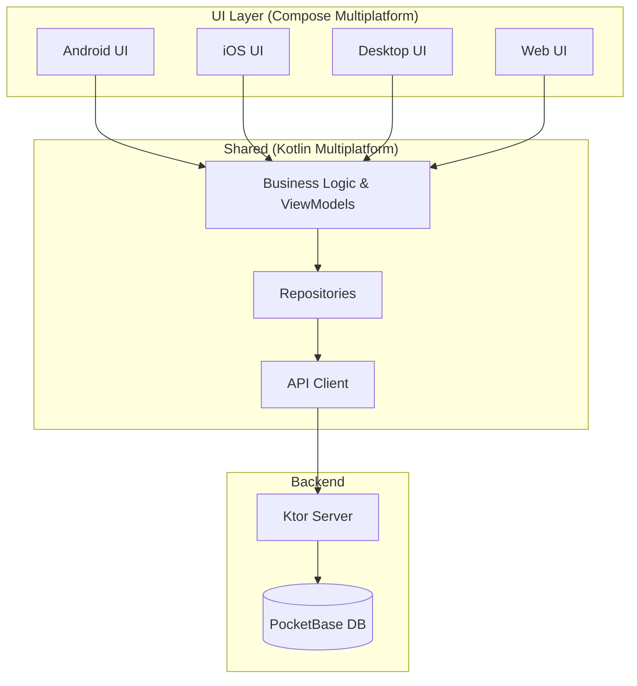

# B-Side: Kotlin Multiplatform Messaging App


[](https://kotlinlang.org)
[](https://www.jetbrains.com/lp/compose-multiplatform/)
[](https://kotlinlang.org/docs/multiplatform.html)
[](LICENSE)

**B-Side** is a production-ready messaging application built with **Kotlin Multiplatform (KMP)** and **Compose Multiplatform**. It demonstrates a "Supercharged" architecture sharing **100% of business logic** and **99% of UI code** across Android, iOS, Desktop, and Web.

---

## 🚀 Quick Start (The Golden Path)

Get up and running with a single command.

### 1. Prerequisites
- **JDK 17+** (Eclipse Temurin 21 recommended)
- **Docker & Docker Compose** (for Backend services)
- **Just** (Command runner) - [Install Guide](https://github.com/casey/just)
    - *Mac:* `brew install just`
    - *Windows:* `choco install just`
- **Node.js 20+** (for Web target)

### 2. Clone & Run
```bash
# 1. Clone the repository
git clone https://github.com/your-org/bside.git
cd bside

# 2. Start everything (Backend + All Clients)
just start
```

**This intelligent script will:**
1. 🐳 Start PocketBase & Ktor Server (Docker)
2. 🖥️ Launch Desktop Client
3. 🌐 Launch Web Client
4. 📱 Launch Android/iOS apps (if emulators/simulators are active)

---

## 🛠️ Building & Running

We provide simplified `just` commands for daily development, and standard Gradle commands for distribution builds.

| Platform | Run (Dev) | Build (Distributable) | Output Location |
| :--- | :--- | :--- | :--- |
| **Backend Stack** | `just up` | `./gradlew :server:shadowJar` | `server/build/libs/` |
| **Desktop** | `just desktop` | `./gradlew :composeApp:createDistributable` | `composeApp/build/compose/binaries/` |
| **Web** | `just web` | `./gradlew :composeApp:jsBrowserProductionWebpack` | `composeApp/build/dist/js/` |
| **Android** | `just android` | `./gradlew :composeApp:assembleRelease` | `composeApp/build/outputs/apk/` |
| **iOS** | `just ios` | `./gradlew :composeApp:linkReleaseFrameworkIosArm64` | `composeApp/build/bin/iosArm64/` |

### Detailed Platform Instructions

<details>
<summary><strong>🤖 Android</strong></summary>

1. Open `android/` in Android Studio.
2. Select a run configuration and device.
3. Click **Run**.
- Or use CLI: `./scripts/run-android.sh`
</details>

<details>
<summary><strong>🍎 iOS (macOS only)</strong></summary>

1. Ensure Xcode 15+ is installed.
2. Run `just ios` to open the Xcode workspace.
3. Select a Simulator or Device and click **Run**.
- Or use CLI: `./scripts/run-ios.sh`
</details>

<details>
<summary><strong>🖥️ Desktop (JVM)</strong></summary>

- **Hot Reload:** `just desktop-hot` (Experimental)
- **Standard:** `just desktop`
- **Native Installers:**
    - Mac (DMG): `./gradlew :composeApp:packageDmg`
    - Windows (MSI): `./gradlew :composeApp:packageMsi`
    - Linux (DEB): `./gradlew :composeApp:packageDeb`
</details>

<details>
<summary><strong>🌐 Web (JS/Wasm)</strong></summary>

- **Dev Server:** `just web` (starts at http://localhost:8080)
- **Production Build:** The output in `composeApp/build/dist/js/productionExecutable/` can be served by any static host (Nginx, Netlify, Vercel).
</details>

---

## 🚢 Deployment

Detailed deployment guides are available for each component.

### 1. Database (PocketBase)
We use **PocketHost** for production database hosting or a self-hosted Docker container.
- **Migration Workflow:**
    1. `just test-migrations` (Validate locally)
    2. `just migrate-prod` (Apply to production)
- [👉 **View Deployment Workflow**](docs/DEPLOYMENT_WORKFLOW.md)

### 2. Backend API (Ktor)
The Ktor server acts as the API Gateway and Auth/Validation layer.
- **Containerize:** `docker build -t bside-server .`
- **Deploy:** Supports AWS ECS, Google Cloud Run, or any Docker-compatible host.
- [👉 **View AWS Setup Guide**](docs/AWS_CDN_SETUP.md)

### 3. Frontend Distribution
- **Android:** Distribute `.apk` or `.aab` via Google Play Console.
- **iOS:** Archive via Xcode for TestFlight/App Store.
- **Web:** Deploy the `build/dist/js/productionExecutable` folder to Netlify/Vercel.
- **Desktop:** Distribute platform-specific installers (.dmg, .msi, .deb).
- [👉 **View Distribution Guide**](docs/DISTRIBUTION.md)

---

## 🏗️ Architecture Overview

B-Side uses a centralized architecture where **Shared Code** drives specific **UI implementations**.



### Key Technologies
- **UI:** Jetpack Compose Multiplatform
- **Navigation:** Voyager
- **Dependency Injection:** Koin
- **Async:** Kotlin Coroutines & Flow
- **Network:** Ktor Client
- **Database:** PocketBase (Real-time)

---

## 📂 Project Structure

| Directory | Description |
| :--- | :--- |
| **`composeApp`** | Main UI application (Compose Multiplatform). Contains `commonMain`, `androidMain`, `iosMain`, `jvmMain`, `webMain`. |
| **`shared`** | Core business logic, repositories, and ViewModels. Shared across all platforms. |
| **`server`** | Ktor backend service acting as the API gateway. |
| **`pocketbase`** | Database schema, migrations, and types. |
| **`scripts`** | Automation scripts for building, running, and testing. |
| **`docs`** | [Comprehensive documentation library](docs/). |

---

## 📚 Documentation & Resources

- **[Setup Guide](docs/setup/PLATFORM_SETUP_GUIDE.md)** - Detailed environment setup.
- **[Build & Test Guide](docs/BUILD_AND_TEST_GUIDE.md)** - Deep dive into build artifacts and testing.
- **[Design System](docs/reference/DESIGN_SYSTEM.md)** - UI components and styling.
- **[PocketBase Schema](docs/reference/POCKETBASE_SCHEMA.md)** - Database structure.

---

> Built with ❤️ by the B-Side Team.