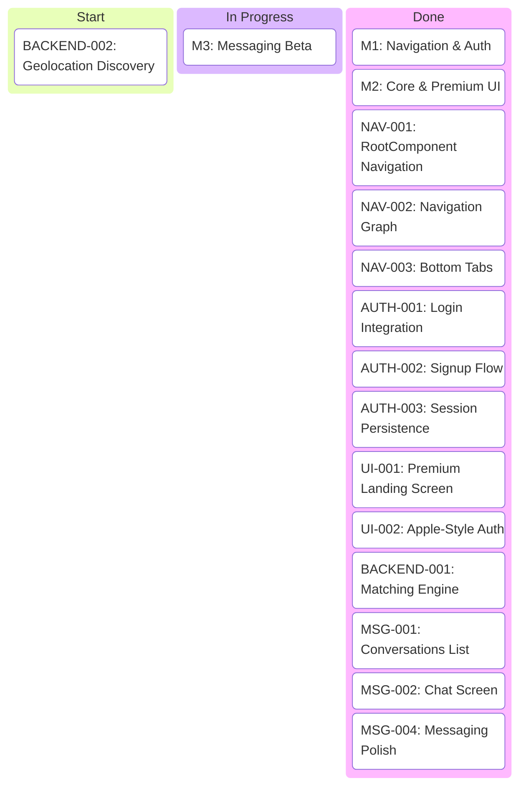
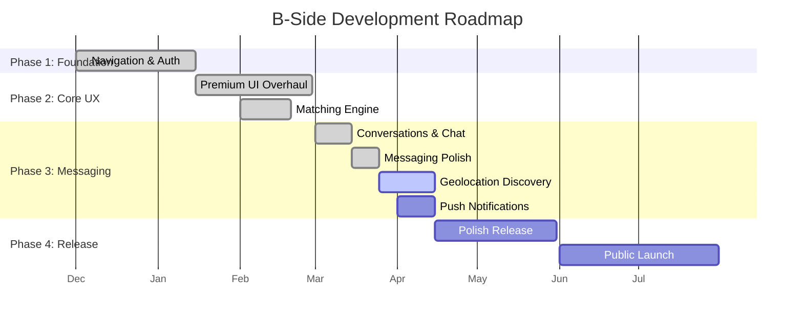

# B-Side Project Dashboard

This dashboard visualizes the current status of the B-Side project based on Code-HQ data.

## Project Status Board



## Implementation Timeline



## Component Architecture

```mermaid
graph TD
    User[User] --> Apps
    
    subgraph Clients [Multiplatform Clients]
        Apps[Android / iOS / Desktop / Web]
        Auth[Auth Feature]
        Nav[Navigation (Decompose)]
        Msg[Messaging SDK]
        
        Apps --> Nav
        Nav --> Auth
        Nav --> Msg
    end
    
    subgraph Backend [PocketBase + Logic]
        API[PocketBase API]
        DB[(SQLite)]
        Cron[Matching Engine (Cron)]
        
        Auth --> API
        Msg --> API
        API --> DB
        Cron --> DB
    end
```
