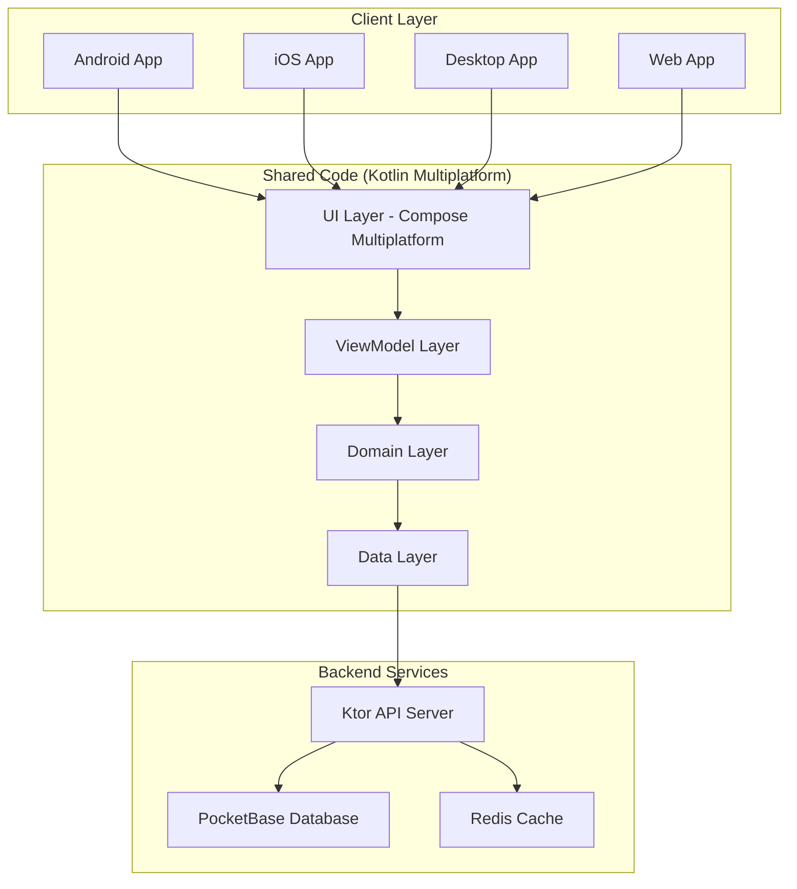

# Architecture Overview

B-Side employs a **modern, scalable architecture** that maximizes code sharing while maintaining platform-specific optimization.

## High-Level Architecture



## Architectural Principles

### 1. Code Sharing Maximization
- **100%** business logic shared
- **99%** UI code shared with Compose Multiplatform
- **Platform-specific** only when necessary

### 2. Clean Architecture
- **Separation of Concerns**: Each layer has a single responsibility
- **Dependency Inversion**: Dependencies point inward
- **Testability**: Easy to test each layer independently

### 3. Reactive Programming
- **Kotlin Flow**: Reactive data streams
- **Coroutines**: Structured concurrency
- **State Management**: Unidirectional data flow

## Layer Breakdown

### UI Layer (Compose Multiplatform)

**Responsibility**: Render UI and handle user interactions

**Components**:
- Screens (Voyager)
- Composable functions
- Theme system
- Navigation

```kotlin
@Composable
fun MessagesScreen(
    viewModel: MessagesViewModel = getViewModel()
) {
    val state by viewModel.state.collectAsState()
    
    when (state) {
        is Loading -> LoadingIndicator()
        is Success -> MessagesList(state.messages)
        is Error -> ErrorView(state.error)
    }
}
```

**Code Sharing**: 99% shared across platforms

### ViewModel Layer

**Responsibility**: Manage UI state and business logic

**Components**:
- ViewModels with StateFlow
- UI state management
- Event handling
- Use case orchestration

```kotlin
class MessagesViewModel(
    private val getMessages: GetMessagesUseCase,
    private val sendMessage: SendMessageUseCase
) : ViewModel() {
    
    private val _state = MutableStateFlow<MessagesState>(Loading)
    val state: StateFlow<MessagesState> = _state.asStateFlow()
    
    init {
        loadMessages()
    }
    
    fun sendMessage(text: String) {
        viewModelScope.launch {
            sendMessage(text).fold(
                onSuccess = { /* update state */ },
                onFailure = { /* handle error */ }
            )
        }
    }
}
```

**Code Sharing**: 100% shared across platforms

### Domain Layer

**Responsibility**: Core business logic and rules

**Components**:
- Use Cases
- Domain Models
- Business Rules
- Repository Interfaces

```kotlin
class SendMessageUseCase(
    private val messagesRepository: MessagesRepository,
    private val validator: MessageValidator
) {
    suspend operator fun invoke(
        conversationId: String,
        text: String
    ): Result<Message> {
        // Validate input
        validator.validate(text).onFailure { 
            return Result.failure(it)
        }
        
        // Send message
        return messagesRepository.sendMessage(
            conversationId = conversationId,
            text = text
        )
    }
}
```

**Code Sharing**: 100% shared across platforms

### Data Layer

**Responsibility**: Data access and persistence

**Components**:
- Repository Implementations
- API Clients
- Local Database
- Cache Management

```kotlin
class MessagesRepositoryImpl(
    private val api: MessagesApi,
    private val cache: MessageCache,
    private val db: MessageDatabase
) : MessagesRepository {
    
    override suspend fun getMessages(
        conversationId: String
    ): Result<List<Message>> = withContext(Dispatchers.IO) {
        try {
            // Try cache first
            cache.get(conversationId)?.let { 
                return@withContext Result.success(it)
            }
            
            // Fetch from API
            val messages = api.getMessages(conversationId)
            
            // Update cache
            cache.put(conversationId, messages)
            
            Result.success(messages)
        } catch (e: Exception) {
            Result.failure(e)
        }
    }
}
```

**Code Sharing**: 100% shared across platforms

## Backend Architecture

### Ktor API Server

**Responsibilities**:
- API Gateway
- Request validation
- Rate limiting
- Authentication middleware
- Request/response logging

**Technology**: Ktor (Kotlin)

### PocketBase Database

**Responsibilities**:
- Data persistence
- Real-time subscriptions (SSE)
- File storage
- Built-in admin UI

**Technology**: PocketBase (Go)

### Redis Cache

**Responsibilities**:
- Session storage
- Rate limit tracking
- Temporary data cache

**Technology**: Redis

## Dependency Injection

B-Side uses **Koin** for dependency injection:

```kotlin
val appModule = module {
    // ViewModels
    viewModel { MessagesViewModel(get(), get()) }
    
    // Use Cases
    factory { GetMessagesUseCase(get()) }
    factory { SendMessageUseCase(get(), get()) }
    
    // Repositories
    single<MessagesRepository> { 
        MessagesRepositoryImpl(get(), get(), get()) 
    }
    
    // API Clients
    single { MessagesApi(get()) }
}
```

## State Management

### Unidirectional Data Flow

```
┌─────────────┐
│    View     │
│  (Compose)  │
└──────┬──────┘
       │ User Action
       ▼
┌─────────────┐
│  ViewModel  │
└──────┬──────┘
       │ Business Logic
       ▼
┌─────────────┐
│  Use Case   │
└──────┬──────┘
       │ Data Operation
       ▼
┌─────────────┐
│ Repository  │
└──────┬──────┘
       │ New State
       ▼
┌─────────────┐
│  StateFlow  │
└──────┬──────┘
       │ Emit State
       ▼
┌─────────────┐
│    View     │ ← Re-render
└─────────────┘
```

### State Classes

```kotlin
sealed class MessagesState {
    object Loading : MessagesState()
    data class Success(val messages: List<Message>) : MessagesState()
    data class Error(val error: String) : MessagesState()
}
```

## Real-Time Architecture

### Server-Sent Events (SSE)

B-Side uses SSE for real-time updates:

```kotlin
class RealTimeManager(
    private val apiClient: ApiClient
) {
    private val eventSource = EventSource("${apiClient.baseUrl}/realtime")
    
    val messages: Flow<Message> = callbackFlow {
        eventSource.addEventListener("messages") { event ->
            val message = Json.decodeFromString<Message>(event.data)
            trySend(message)
        }
        
        awaitClose { eventSource.close() }
    }
}
```

**Why SSE over WebSockets?**
- Simpler implementation
- Automatic reconnection
- Browser-native support
- One-way communication sufficient
- Better with HTTP/2

## Platform-Specific Code

While most code is shared, some platform-specific implementations are needed:

### Expect/Actual Pattern

```kotlin
// commonMain
expect fun getPlatformName(): String

// androidMain
actual fun getPlatformName() = "Android"

// iosMain
actual fun getPlatformName() = "iOS"

// jvmMain
actual fun getPlatformName() = "Desktop"

// jsMain
actual fun getPlatformName() = "Web"
```

### Common Platform-Specific Code

- **File system access**
- **Camera/photo picker**
- **Notifications**
- **Biometric authentication**
- **Deep linking**
- **App lifecycle**

## Performance Optimizations

### 1. Lazy Loading
- Load messages on-demand
- Infinite scroll pagination
- Image lazy loading

### 2. Caching Strategy
```
┌──────────────┐
│  UI Request  │
└──────┬───────┘
       │
       ▼
  ┌─────────┐
  │  Cache? │
  └────┬────┘
    Yes│  No
       │   │
       │   ▼
       │ ┌────────┐
       │ │  API   │
       │ └───┬────┘
       │     │
       │     ▼
       │ ┌────────┐
       │ │ Update │
       │ │ Cache  │
       │ └───┬────┘
       │     │
       └─────┴───────►
       │
       ▼
  ┌─────────┐
  │   UI    │
  └─────────┘
```

### 3. Memory Management
- Dispose subscriptions
- Clear caches periodically
- Use pagination
- Compress images

## Security

### 1. Authentication
- JWT tokens with refresh
- Secure token storage
- Auto token refresh

### 2. Data Protection
- HTTPS only in production
- Encrypted local storage
- No sensitive data in logs

### 3. Input Validation
- Client-side validation
- Server-side validation
- Sanitize user input

## Testing Strategy

### Unit Tests
```kotlin
class SendMessageUseCaseTest {
    @Test
    fun `should send message successfully`() = runTest {
        // Given
        val useCase = SendMessageUseCase(
            repository = FakeMessagesRepository(),
            validator = MessageValidator()
        )
        
        // When
        val result = useCase("conv123", "Hello!")
        
        // Then
        assertTrue(result.isSuccess)
    }
}
```

### Integration Tests
Test interaction between layers

### UI Tests
Compose Multiplatform UI testing

## Scalability Considerations

### Horizontal Scaling
- Stateless API servers
- Session storage in Redis
- Load balancing ready

### Database Optimization
- Indexed queries
- Connection pooling
- Query optimization

### Caching Strategy
- Multi-level caching
- Cache invalidation
- CDN for static assets

---

> 📘 Learn More
> 
> - [Messaging Architecture](messaging)
> - [Database Schema](../reference/database-schema)
> - [API Architecture](../api-reference/overview)
